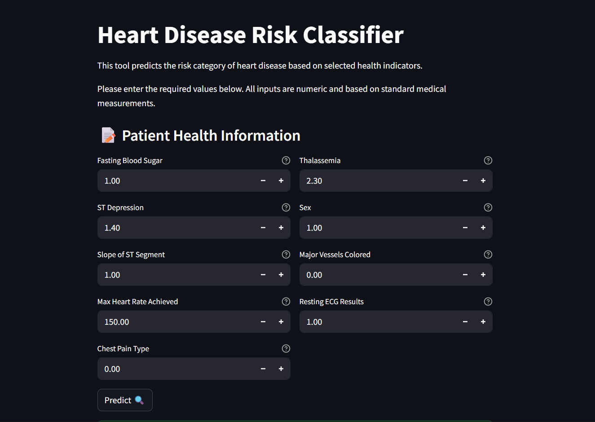
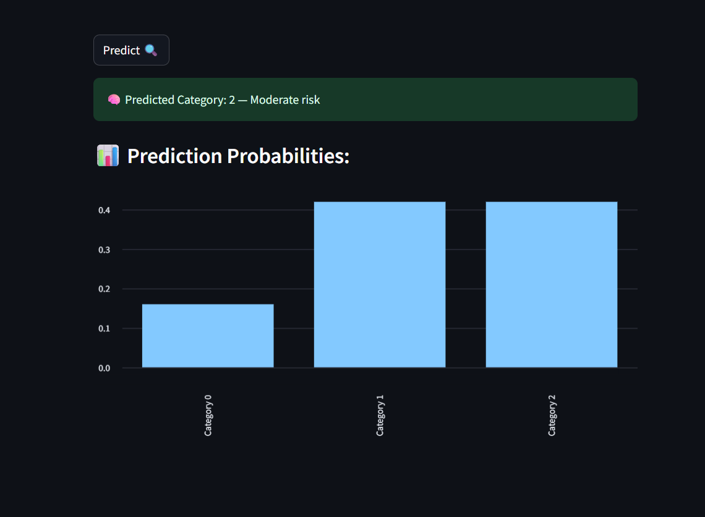

# 🫀 Heart Disease Risk Classification Project

This project predicts **heart disease risk categories** using machine learning.  
It includes a full end-to-end workflow: data preprocessing, dimensionality reduction (PCA), feature selection, supervised & unsupervised learning, hyperparameter tuning, and deployment with a Streamlit web app.

---
## 📁 Heart_Disease_Project 

``` 
├── data/ # Dataset(s) 
│ └── heart_disease.csv 
├── notebooks/ # Step-by-step workflow 
│ ├── 01_data_preprocessing.ipynb 
│ ├── 02_pca_analysis.ipynb 
│ ├── 03_feature_selection.ipynb 
│ ├── 04_supervised_learning.ipynb 
│ ├── 05_unsupervised_learning.ipynb 
│ ├── 06_hyperparameter_tuning.ipynb 
├── models/ 
│ ├── final_pipeline.pkl 
├── ui/  
│ └── app.py 
├── deployment/ 
│ └── ngrok_setup.txt
├── results/ # Evaluation results 
│ └── evaluation_metrics.txt 
├── README.md # Project documentation 
├── requirements.txt # Dependencies 
└── .gitignore # Ignored files 
```

---

## 🚀 How to Run Locally

1. **Clone the repository**
   ```bash
   git clone https://github.com/mennaali8652/Heart_Disease_Project.git

   cd Heart_Disease_Project

2. **Install dependencies**
    ```bash
    pip install -r requirements.txt

3. **Run the Streamlit app**
    ```bash
    streamlit run ui/app.py

---
📊 Results

- **Final model**: LogisticRegression (after hyperparameter tuning)

- **Accuracy**: ~0.78

- **Macro F1**: ~0.81

    Detailed metrics are available in results/evaluation_metrics.txt

---

## 🧠 Features Used
Final selected features for prediction:

- **fbs**: Fasting Blood Sugar  
- **thal**: Thalassemia  
- **oldpeak**: ST Depression  
- **sex**: 0 = female, 1 = male  
- **slope**: Slope of ST Segment  
- **ca**: Number of Major Vessels  
- **thalach**: Max Heart Rate Achieved  
- **restecg**: Resting ECG Results  
- **cp**: Chest Pain Type

---

### 🖼️ App Screenshots

#### 🔹 Input Interface


#### 🔹 Prediction Output


---

## 🙌 Acknowledgements
Dataset: https://archive.ics.uci.edu/ml/datasets/heart+Disease

Built with: Python, scikit-learn, Streamlit